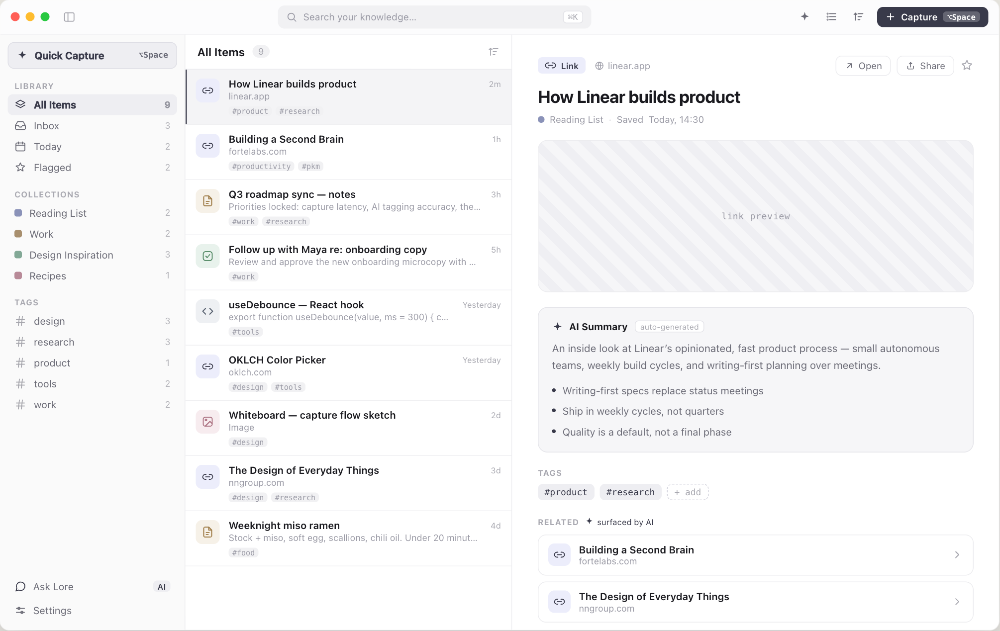
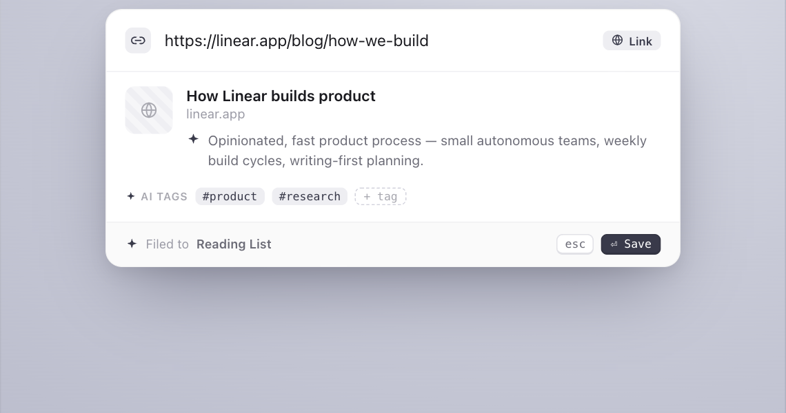
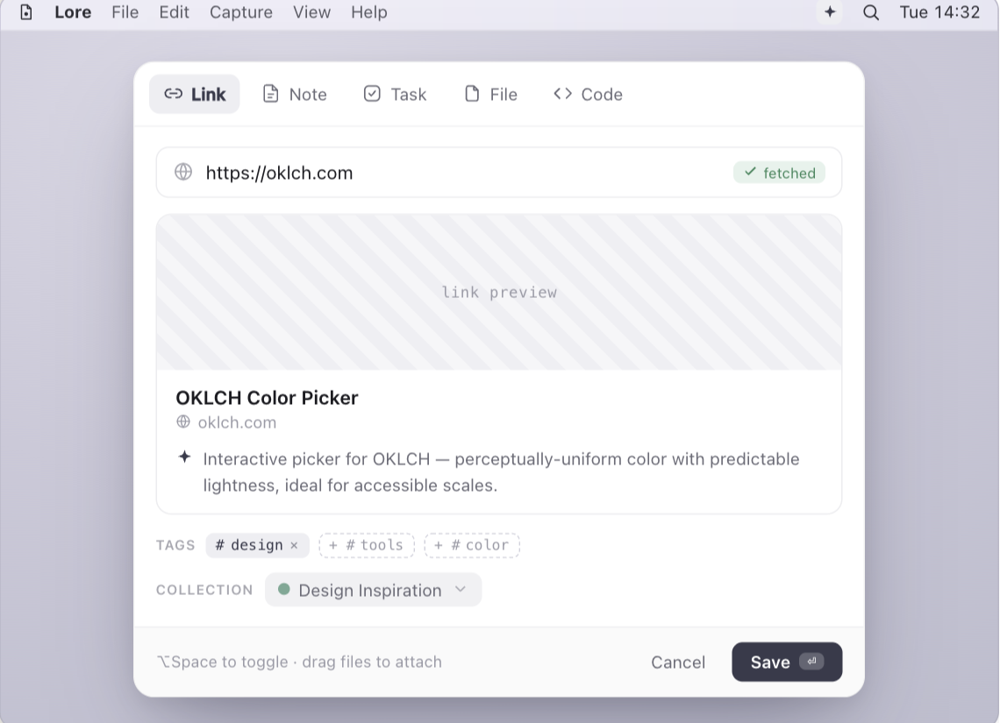
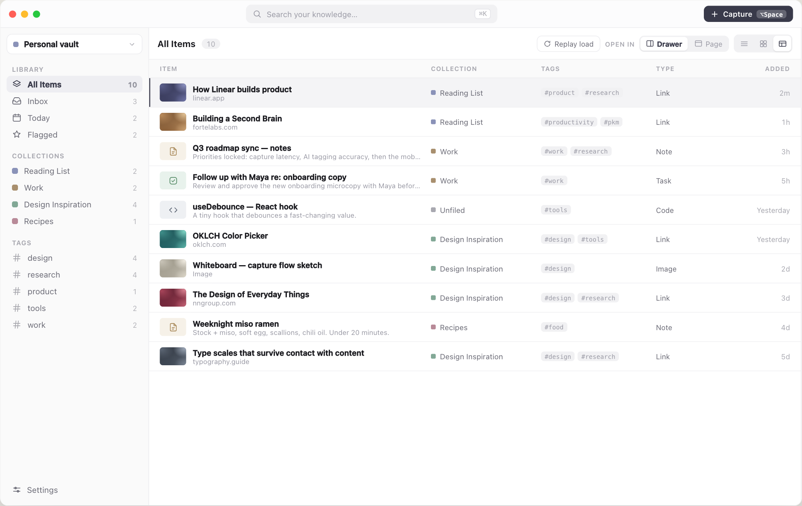
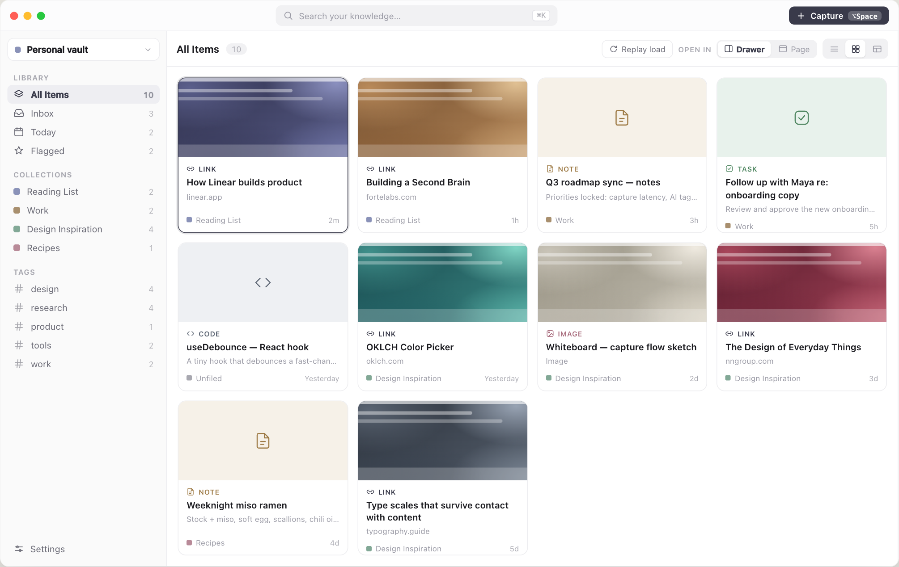
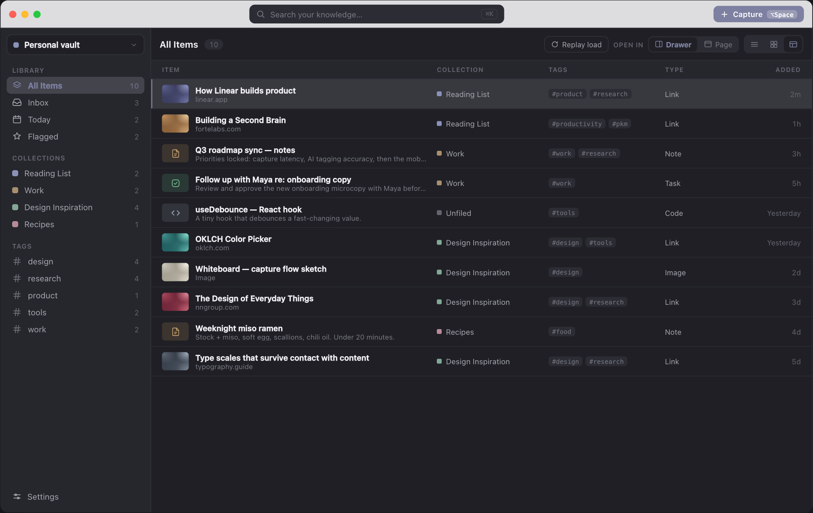

# 📚 Lore

hey 👋

Lore is an **offline-first personal knowledge base** with global-hotkey quick
capture. Press **⌥Space** anywhere, drop in a link, note, task or code snippet,
and Lore files it into a folder of Markdown files you can browse, search, ask
questions about — and commit.

I built it because every tool I tried made me choose between a nice reading
surface and owning my data. Lore is:

- **a capture bar** that stays out of the way — ⌥Space, type, enter, gone
- **a knowledge base** — sidebar + list + detail, with list, card and table views
- **a folder of `.md` files** — not a database with an export button



Your library is a directory of Markdown files with YAML frontmatter. The files
_are_ the data. Point Lore at a git repo, edit a note in Obsidian or vim,
`git pull` on another machine — the app follows along without a restart.

> The screenshots in this README are rendered straight from the Claude Design
> sources (`Lore.dc.html`, `Lore Knowledge Base Views.dc.html`), which the UI is
> recreated from pixel-for-pixel.

## Principles

- 🗂️ **The filesystem is the database.** Folders are collections, files are
  items. Move a file in Finder and it is refiled in Lore.
- ✍️ **Never lose what you typed.** Unknown frontmatter keys survive a
  round-trip; a `[[wikilink]]` to a note that does not exist yet is preserved
  byte-for-byte and heals itself when the target appears.
- 🔌 **Offline first, network never required.** No account, no sync service, no
  telemetry. AI is a pluggable provider and ships as a deterministic mock.
- 🔒 **The renderer is not trusted.** The webview gets no shell permission; the
  data engine is spawned by Rust and reached over a loopback port with a bearer
  token passed by environment variable, never argv.
- ⚡ **Capture in under a second.** A global shortcut, a frameless panel, and two
  ways in — a command bar or a composer.
- ♻️ **Derived state is disposable.** Delete `.lore/index.db` and it rebuilds
  from the files. It is never migrated; a schema change throws it away.
- 🧭 **No surprise renames.** Retitling an item does not rename its file, because
  that would rewrite every inbound link and churn your git history.
- 🗑️ **Deletes move to trash**, they do not unlink.
- 🙈 **Lore never runs git.** The vault is a folder. Committing it is up to you.

## Quick capture · ⌥Space

The capture window is frameless, always on top, and offers both directions.

**Direction A — Command bar.** Type anything; AI detects what it is, titles it,
tags it and files it.



**Direction B — Composer.** Pick a type up front, add structure, then save.



⌥Space toggles between them, and files can be dragged straight onto the panel.

## Views

The list pane renders three ways. **Table** puts collection, tags, type and age
in columns — the view for triaging a backlog rather than reading it.



**Cards** is the browsing view; items with a banner URL show a hashed placeholder
while the preview loads.



Every surface is themed from one token set, so dark mode is a repaint, not a
second stylesheet.



## Install

Lore is not packaged yet. Build it from source:

```bash
pnpm install
pnpm tauri dev        # launches the desktop app (first run compiles Rust)
```

Other scripts:

```bash
pnpm build            # type-check + build the web bundles
pnpm test             # vitest (renderer) + bun test (data engine)
pnpm dev:sidecar      # run the data engine alone, on a fixed dev port
pnpm build:sidecar    # compile the engine binary Tauri bundles
pnpm tauri build      # produce a distributable .app/.dmg
```

## Getting started

First launch shows onboarding: sign in with Apple / Google / an email link, or
start a local vault. Identity providers and mail delivery are stubs today, so
**start a local vault** is the path that works end to end.

You get a global vault at `~/Library/Application Support/com.lore.app/Vault`,
plus **Open Folder…** to point Lore at any directory — a git repo, an existing
Obsidian vault, a Dropbox folder. The switcher sits at the top of the sidebar
with a recents list.

Switching clears items, collections, selection, search and view before
re-hydrating: ids do not mean the same thing in another folder. Only the default
vault is ever seeded — writing sample notes into a folder you chose would be
hostile.

## The vault

```
<vault>/
  .lore/
    .gitignore          committed — ignores the derived files below
    collections.json    committed — folder colours and order
    workspace.json      committed — schema version, tag order
    index.db            ignored — derived, deletable, rebuilt on open
    cache/  trash/      ignored
  attachments/          reserved; never a collection
  Reading List/
    how-linear-builds-product.md
  Work/
  some-unfiled-note.md  ← the vault root means "uncollected"
```

**Folders are collections.** `collectionId` is never written to frontmatter — it
is derived from the parent directory, so moving a file in Finder refiles it in
Lore and there is only ever one source of truth. Items with no collection sit at
the vault root.

```markdown
---
id: 01J8ZQ4F7K3M8YB2VNXR6TWDPA
type: link # link | note | task | code | image
title: How Linear builds product
url: https://linear.app/blog/how-linear-builds-product
created: 2026-08-30T10:12:04.000Z
updated: 2026-08-31T09:00:00.000Z
tags: [product, research]
inbox: true # flags are flat and omitted when false
related:
    - '[[building-a-second-brain]]'
---

The Markdown body — the note's content, or your own notes on a link.
```

**A plain folder of Markdown just works.** A folder with no `collections.json`
entry is still a collection, coloured from a hash of its name. A file with no
frontmatter is a valid note; its title falls back to the first heading, then the
filename.

## Architecture

Three processes, with one seam between them.

|                                      | Owns                                                                          |
| ------------------------------------ | ----------------------------------------------------------------------------- |
| **Renderer** (React)                 | UI, Zustand store, view selectors, preferences in localStorage                |
| **Data engine** (Bun/Elysia sidecar) | The vault files, YAML, the SQLite/FTS5 index, the file watcher, link metadata |
| **Rust/Tauri**                       | Windows, tray, ⌥Space, spawning and supervising the engine, the folder picker |

Everything the UI does goes through a single `KnowledgeRepository`
(`src/data/repository.ts`), so the app is agnostic to where data lives:

| Implementation                             | When it's used           | Role                                                               |
| ------------------------------------------ | ------------------------ | ------------------------------------------------------------------ |
| `VaultRepository` (`vaultRepository.ts`)   | inside Tauri             | **source of truth** — Markdown files, over HTTP to the engine      |
| `MemoryRepository` (`memoryRepository.ts`) | Vite preview, unit tests | seed-backed                                                        |
| `LocalRepository` (`localRepository.ts`)   | _legacy_                 | SQLite; kept only so the one-shot import can read an old `lore.db` |

`src/data/index.ts` picks the implementation and owns the teardown a workspace
switch needs.

### The data engine

A compiled Bun binary shipped as a Tauri `externalBin` and spawned by Rust — the
webview is granted no `shell:` permission, so nothing in the renderer can start a
process. It binds `127.0.0.1` on an ephemeral port and prints one handshake line;
Rust reads it and hands the renderer an endpoint plus a bearer token.

`listItems()` deliberately omits bodies — it re-runs after every mutation, so
shipping every body through it would serialize the whole vault on each
keystroke-triggered save. `getItem()` is the only route that returns one, and the
store keeps the selected item in `detail`.

Search goes to FTS5 for queries of three characters or more, which is what lets
it reach text the list pane cannot see; shorter queries use the client-side
filter over already-loaded titles.

The watcher reconciles the index _before_ it notifies, and recognises the
engine's own writes by content hash — several filesystem events for one write are
all suppressed, while someone else's edit lands with a different hash and gets
through.

In development the engine runs separately under `bun --watch` on a fixed port, so
editing it never triggers a Rust rebuild.

### Windows

- `main` — the three-pane knowledge base (sidebar · list · detail/chat).
- `capture` — the frameless Quick Capture panel toggled by **⌥Space** (registered
  in `src-tauri/src/lib.rs`; window control in `commands.rs`).

The capture window is a separate webview with its own repository instance, so it
follows a `workspace:changed` broadcast — otherwise the next capture after a
workspace switch would land in the folder you just left.

### Migration

On a launch where the vault is empty, Lore imports a legacy `lore.db` and renames
it to `lore.db.premigration` — never deletes it. The guard is the vault's actual
state, not a "have I migrated" flag: a flag can be set by an attempt that then
failed, and the cost of that is a whole library stranded in a database the app no
longer reads.

Changing the bundle identifier moves the entire app-data folder, so it is a data
migration and not a rename. The import only looks in the current one.

### AI, settings, styling

**AI is pluggable** (`src/ai/aiProvider.ts`). The deterministic `MockAiProvider`
powers summaries, tag suggestions, type detection and the "Ask Lore" chat with
zero network or keys. A real provider belongs in the data engine, so the API key
never reaches the renderer — not yet built.

**Settings is a modal sheet** (`components/settings/`) with the design's ten
panes. Accent, appearance, list density, text size, AI location and the full
switch set write through the store and persist; panes that need a backend
(devices, billing, calendar accounts) render the design's copy against
placeholder figures.

**Styling is Tailwind CSS v4**, with `src/theme/tailwind.css` as the single
stylesheet. Two deliberate departures from stock Tailwind: every length is px
rather than rem (`App.tsx` scales the tree with `zoom` for the Text size
preference), and there is no `dark:` variant — the colour tokens in
`theme/tokens.ts` flip wholesale between light and dark, so `bg-surface` is
already correct in both. See [AGENTS.md](AGENTS.md) for the full conventions.

## Layout

```
src/
  App.tsx                  main KB window shell
  capture.tsx              Quick Capture window entry
  components/
    common/{Icon,glyphs}     SVG icon sets
    common/LoreMark          logo mark + serif wordmark font
    kb/                      TitleBar, Sidebar, WorkspaceSwitcher, ListPane,
                             DetailPane, AiSummaryCard, RelatedCards,
                             AskLoreChat, Notice
    capture/                 CaptureApp, CommandBar (A), Composer (B)
    onboarding/              first-launch sheet (sign in / local vault / magic link)
    settings/                modal sheet, ten panes, shared controls
  data/                      repository seam; vault (HTTP) + memory impls,
                             sidecarClient, derive, migrateSqlite, legacy SQLite
  store/                     types, seed, typeMeta, views (selectors), useStore,
                             persisted (prefs, auth, workspaces)
  ai/                        AiProvider + MockAiProvider
  lib/                       format, capture helpers, workspace, linkMetadata, cn
  theme/                     tailwind.css, tokens, bootstrap
sidecar/                     the data engine (Bun + Elysia)
  src/markdown.ts            frontmatter ⇄ Item
  src/vault.ts               path safety, folders-as-collections, .lore/
  src/links.ts               wikilink parse / resolve / rewrite
  src/index/{db,store}.ts    SQLite + FTS5 index and the vault operations
  src/watch.ts               file watching, debounce, self-write suppression
  src/routes.ts              the HTTP surface
  scripts/build.ts           compiles the per-platform binaries
src-tauri/
  src/{lib.rs, commands.rs}  plugins, ⌥Space shortcut, capture window control
  src/sidecar.rs             spawn, handshake, supervise and kill the engine
  tauri.conf.json            windows, externalBin, bundle config
  capabilities/default.json  permission grants
  icons/app-icon.svg         Dock icon master — regenerate the rasters with
                             `pnpm tauri icon src-tauri/icons/app-icon.svg -o src-tauri/icons`
  icons/tray-icon.svg        menu-bar master (monochrome template, auto-inverts)
docs/images/                 README screenshots, rendered from the design sources
```

## Testing

```bash
pnpm test              # both suites
pnpm test:sidecar      # the data engine alone
```

The engine's suite runs against real temporary vaults on disk — round-tripping
frontmatter, folder⇄collection mapping, wikilink preservation and healing,
incremental reindexing when mtimes lie, rename with link rewriting, and the
path-traversal guard on the HTTP boundary.

## Status

The knowledge base, quick capture, onboarding, the settings modal, light/dark
theming and the Markdown vault are all in place, including workspaces, live
updates from external edits, full-text search and the import from the legacy
SQLite store.

Known gaps:

- **`tauri-plugin-sql` is still present.** It is the only reader of the legacy
  store; it should be dropped a release after the import has shipped, along with
  `migrateSqlite.ts`, `localRepository.ts` and `schema.ts`.
- **Tag order is half-built.** A vault can carry its own order in
  `.lore/workspace.json` and the engine serves it, but nothing writes it — there
  is no reordering UI, so vaults fall back to the sample order.
- **No manual reindex.** `POST /workspace/reindex` exists with no UI, so a missed
  watcher event has no recovery short of deleting `.lore/index.db`.
- **AI is still the mock, and still in the renderer.**
- Several settings panes show placeholder figures.

Deferred by design: the Focus and Calendar surfaces — the designs treat those as
windows of their own, so only their preference panes are built. Also nested
collections, dead-link chips in Related, and replacing the full `refresh()` after
every mutation with optimistic updates.

## Contributing

Read [AGENTS.md](AGENTS.md) first — it is the single source of truth for
conventions in this repo, and it covers styling, code style and the commit rules
(Conventional Commits, `bun format` before committing).
